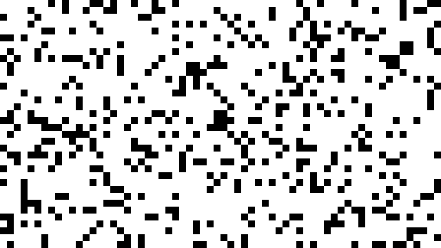

# Conway's Game Of Life - Simulated in Aseprite

Using the Aseprite scripting API (written in Lua) to simulate Conway's Game Of Life

## What is the Game of Life?

It is governed by some simple rules. To start, the "map" is divided up into "cels" (in this case, 1 pixel = 1 cel). A cel can have two states: "alive" (black pixel), or "dead" (white pixel). Each cel has 8 neighbors surrounding it (horizontally, vertically, and diagonally).

The Game of Life is meant to be simulated over many "generations". A generation is simply taking a look at one cel map, and determining what the new cel map should look like following some basic rules:

1) If a cel is alive and has 2 or 3 alive neighbors, it stays alive.
2) If a cel is alive and has less than 2, or more than 3 neighbors, it dies (under/overpopulation).
3) If a cel is dead and has 3 neighbors, it becomes alive (repopulation)

Following these rules, we can generate an arbitrary number of generations in the future. By observing patterns that emerge across these generations, we can learn interesting things!

You can read more about the Game of Life [here](https://en.wikipedia.org/wiki/Conway%27s_Game_of_Life).

## Why Did I Make This?

The Game of Life has always been an interesting simulation to me, and after getting to know Aseprite's scripting API well, I realized that it would lend itself well to this task. Since Aseprite is a pixel art program, and can export to gif, I could quickly create a script that could randomly generate an initial generation and then calculate the remaining generations.

Additionally, I could make an option where the user draws the initial generation. The flexibility of the API allows me to do this and many more interesting things, and so I plan to continue to work on this project from time to time to improve it's capabilities.

Regardless, I hope it provides a level of intrigue and curiosity to others.

## Credits

As an advocate of open-source software, feel free to suggest edits, or just fork this repository and make your own! The license on this software is open for commercial and private use. This extension will remain free forever; however, if you'd like to buy me a coffee, you can do so [here](https://ko-fi.com/fletchmakesstuff).

